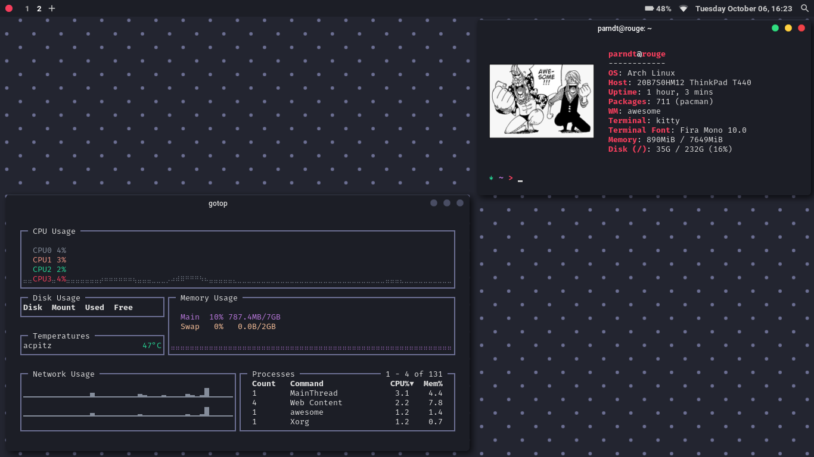
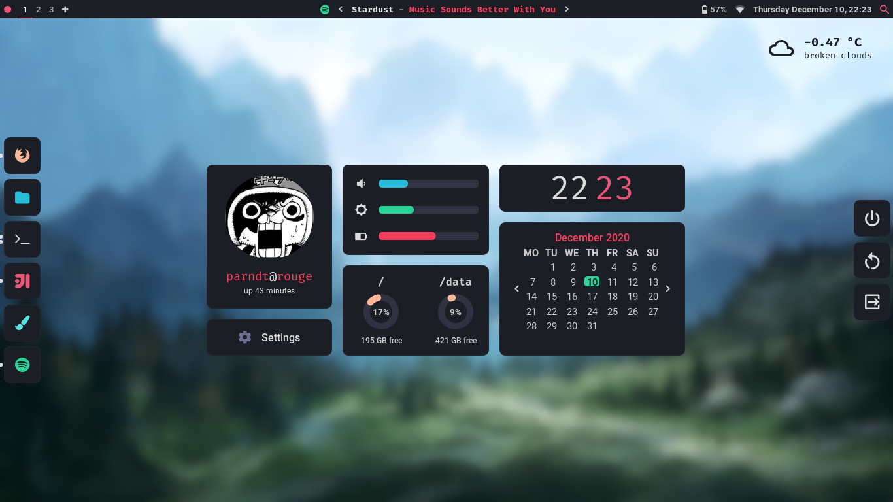
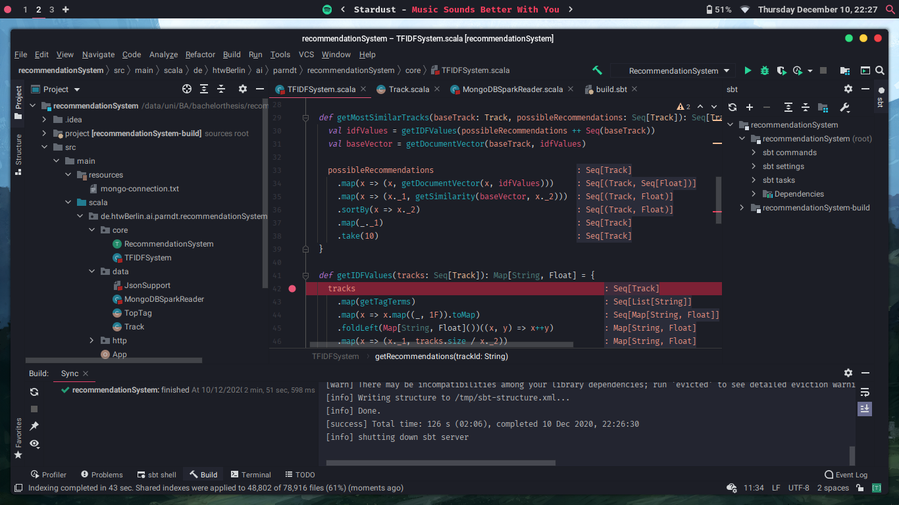

# Dotfiles

Arch Linux dotfiles

## Details

+ **OS**: Arch Linux
+ **WM**: AwesomeWM
+ **Shell**: `zsh` with `oh-my-zsh`
+ **Fonts**: Fira Mono and Roboto
+ **Terminal**: kitty
+ **File Manager**: Thunar
+ **Launcher**: rofi
+ **Browser**: Firefox

### Dependencies

This is basically a write down for myself, in case I have to reinstall. 

+ `awesome-git` - Window manager
+ `zsh` and `oh-my-zsh` - Shell
+ `rofi` - App launcher
+ `kitty` - Terminal
+ `picom` - Compositor
+ `thunar` - File explorer
+ `brightnessctl` - Control brightness
+ `pamixer` - Control volume
+ `sp` - Get Spotify information
+ `nerd-fonts-fira-mono` - Icons
+ `xdotool` - Spawn key combinations

### Screenshots

