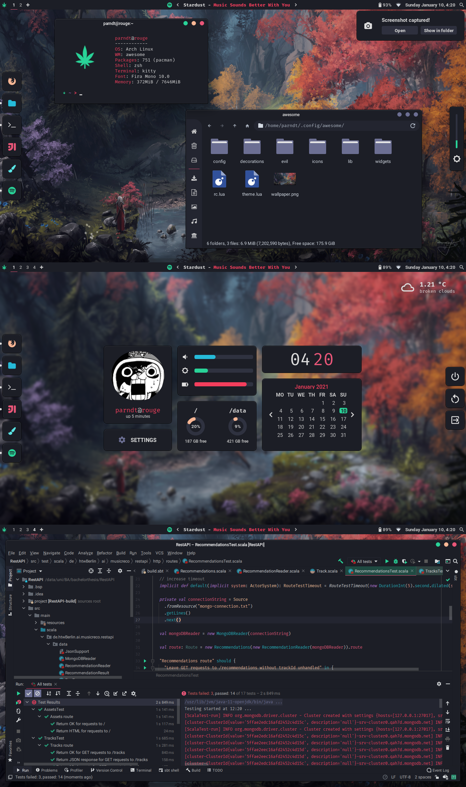

# Dotfiles

Arch Linux dotfiles 

### Dependencies

+ `awesome-git` - Window manager
+ `zsh` and `oh-my-zsh` - Shell
+ `rofi` - App launcher
+ `kitty` - Terminal
+ `picom` - Compositor
+ `firefox` - Browser
+ `thunar` - File explorer
+ `brightnessctl` - Control brightness
+ `pamixer` - Control volume
+ `Fira Mono` and `Roboto` - Fonts
+ `sp` - Get Spotify information
+ `nerd-fonts-fira-mono` - Icons
+ `xdotool` - Spawn key combinations
+ `imagemagick` - Blur images

### Honorable mentions

The borders and anti-aliased corners are based on the [awesome-wm-nice](https://github.com/mut-ex/awesome-wm-nice/) repository. 
